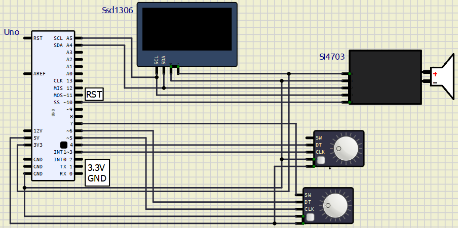
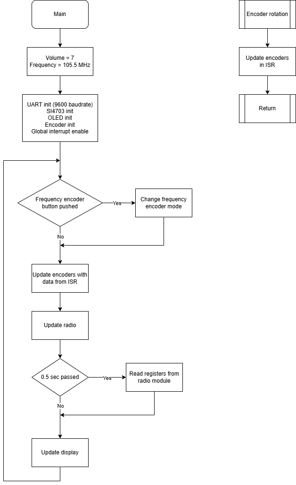
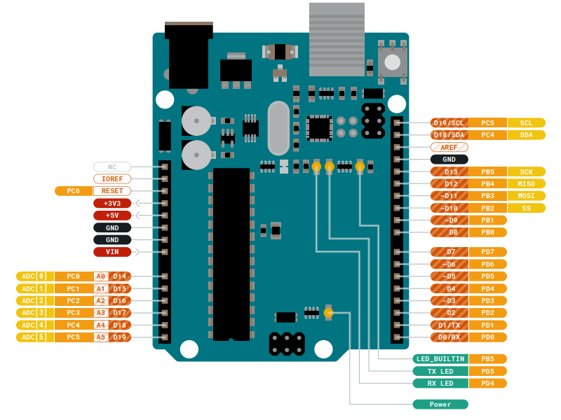
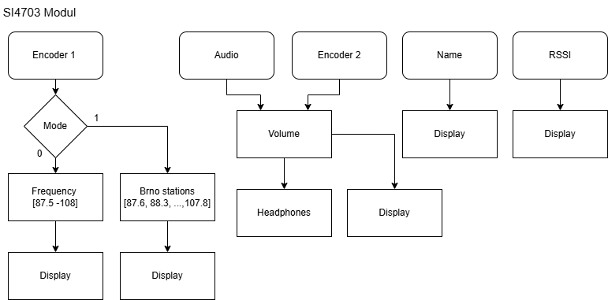
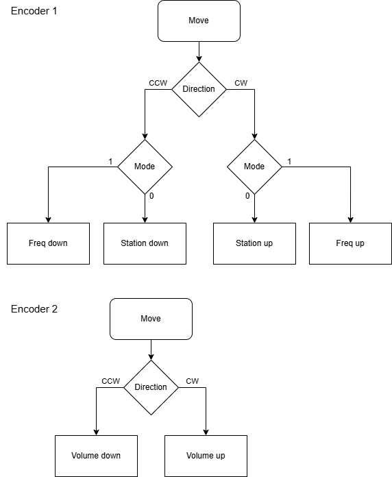
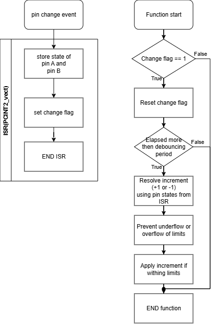

# FM radio receiver with digital tuning

## Team members
- Tadeáš Fojtách (responsible for OLED display configuration)
- David Haisman (responsible for control peripherals)
- Karel Matoušek (responsible for radio module configuration)

## Abstract
This project deals with controlling the radio module SI4703 using the ATmega328 microcontroller and the C programming language. Its goal is to provide the user with a predefined list of stations typically receivable in Brno and allow them to receive the FM broadcast. Two rotary encoders are used, one for radio tuning and one for the volume control. Small OLED display is used to control the radio (volume and frequency) and show the name of current channel.

## Connection of the project

*Project scheme*

*Real project connection*

## Usage manual
As mentioned before, this device uses two rotary encoders. The one used for frequency tuning has two modes, between which the user can switch by pushing the button on it. One mode allows the user to tune the frequency with a 100 kHz step, and the other one is used for going through the predefined station frequencies. The second rotary encoder is used for volume control.

## Documentation
[Documentation](https://haismd03.github.io/de2-project/html/index.html)

## Demonstrative video

## Main program diagram

*Main program diagram*

## Used hardware
### Arduino UNO
Project uses Arduino Uno clone utiliting ATmega328p as a microcontroller.

*Arduino Uno - ATmega328p pinout*

### SI4703
SI4703 is a radio module used for receiving FM radio broadcast. It uses 3.3V logic and I2C to communicate with the controller. To activate the receiver, some device, that can be used as antenna (for example headphones), must be plugged in to the connector. This device is also used for reproducing the decoded received radio signal. 
  

*Radio logic diagram*

### SSD1306
The SSD1306 is an OLED display used to show the volume and frequency selected by the user, as well as the station name and the RSSI (Received Signal Strength Indicator) provided by the SI4703 FM radio module. It communicates over the I²C interface, and the libraries used originate from the DE2 course materials. The display updates its contents using a cursor-based drawing system, where text is written character-by-character into the display buffer before being sent to the OLED.      
  

*Display logic diagram*

### Rotary encoder
This project utilizes two modules with quadrature encoder. Each of this module contains pull-up resistors for *CLK* and *DT* pins.

**Encoder usage:**
- Encoder on the right side is used to set volume of the radio. Value set by this encoder is software limited between values 0 and 15.
- Encoder on the left side has two settings. To toggle between each settings, button on the modul shaft itself is utilized. 
  - *Radio_index* setting (mode=0) is used to navigate in array of predefined frequencies commonly found in Brno"
  - *Frequency* setting (mode=1) sets an exact frequency of the radio. Range of the encoder is set between values 875 and 1080 (corresponding to 87.5 MHz - 108.0 MHz using fixed point numbers)

  

*Encoder usage*

**Encoder program**

Software uses pin change interrupt to capture edge of the signal from *CLK* pin. To ensure fast ISR, only states of *CLK* a *DT* pins are read and change flag is set. This code is encapsulated inside inline function to further increase the execution speed.

Actual increment or decrement is evaluated inside a function executed from main loop. If *change_flag* is set and bouncing is not issued, increment is evaluated from pin states set in ISR. If previous state of *CLK* was *0* and current is *1* rising edge has been detected. In case when current state of *DT* is *0* after a rising edge of *CLK*, CCW rotation of the encoder is detected. Code is similar for other 3 possible combination.

  

## Used third-party codes and libraries
- [AVR-Si4703-V1.5](https://github.com/panosss/AVR-Si4703-V1.5) by panosss
- [avr-labs](https://github.com/tomas-fryza/avr-labs) by tomas-fryza (MIT License)

## License
This project is distributed under the MIT License.
See the [LICENSE](./LICENSE) file for full license text.

Parts of the project include third-party libraries covered by their respective licenses:
- AVR-GCC teaching libraries by Tomáš Fryza — MIT License © 2019–2024
- SI4703 library by KiKi
- oled library by Michael Köhler — Copyright 2016 Skie-Systems
- font library by Michael Köhler — Copyright 2018 Skie-Systems

All third-party components retain their original licenses and copyrights.